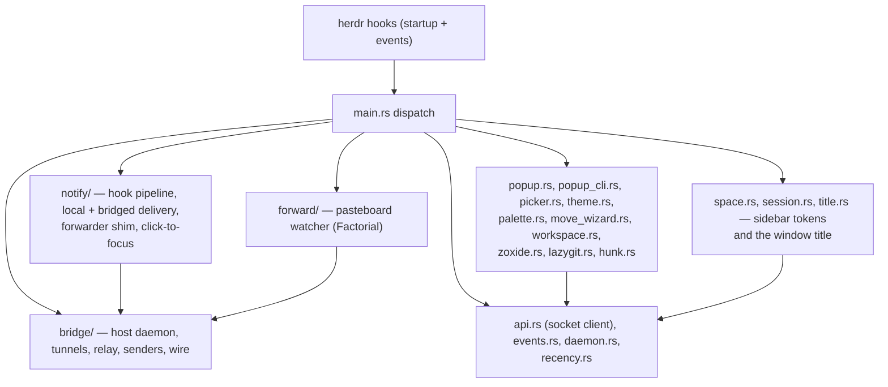

# herdr-cast

## Purpose and risk

This repository is a custom, unpublished Herdr plugin for Aliou's local setup.
It runs on macOS and Linux. Its plugin id is `ad.cast`. It is already linked,
enabled, and loaded from this checkout on this machine; linked plugins are
global to the local user and available to every Herdr session.

Do not run `herdr plugin link`, `herdr plugin unlink`, `herdr plugin install`,
`herdr plugin uninstall`, or change the plugin's enabled state unless the user
explicitly asks. Do not replace the local link with a managed GitHub install.

The plugin executes as the user and can post notifications, change Herdr
layout, focus panes, and raise terminal windows. Treat runtime testing as
state-changing work.

Read `CONTEXT.md` before naming or changing anything that uses its terms
(Space, host, remote, link, relay, token, delivery chain, and so on).

## Non-negotiable runtime isolation

Never test this plugin in the Herdr session containing the current agent or in
the default session. Use a fresh, uniquely named disposable session for every
runtime, event, pane, socket, focus, or layout test.

Read and follow `.agents/skills/herdr-throwaway-repro/SKILL.md` before any such
test. In particular:

- create the disposable session in a new outer pane;
- clear inherited socket, session, workspace, tab, and pane variables;
- explicitly set `HERDR_SESSION=<disposable-name>` on every control command;
- read all IDs from command output instead of constructing them;
- never stop, restart, delete, or kill the main Herdr server;
- close only the pane and named session created for the test; and
- complete cleanup even when the test fails.

Installed and linked plugins and their state are shared across named sessions.
Do not alter the existing `ad.cast` registration or real state to make a test
pass. If a manifest-registration test is necessary, copy the plugin to
`/var/tmp`, give the copy a unique temporary plugin id, link that id while
addressing only the disposable session, and unlink that exact temporary id
during cleanup. Do not run a live notification test unless the user explicitly
accepts the desktop notification and Launch Services side effects.

Read-only commands such as version, help, schema, plugin-list, and log
inspection are safe for discovery. Any command intended to exercise plugin
behavior belongs in the disposable session.

## Installed interface and protocol

The installed `herdr` binary is the authority for CLI syntax and protocol
shape. Inspect `herdr --version` and the relevant command group's help before
using it; do not assume the adjacent Herdr source checkout matches the running
version. Run `herdr api schema` (optionally with `--output /var/tmp/...`) before
adding or changing raw socket requests, response parsing, event payload
assumptions, or plugin context fields. Do not copy the schema into this
repository.

## Commands and checks

Run checks from the repository root. Cargo is not normally on PATH here:

```bash
nix-shell -p cargo rustc rustfmt --run 'cargo fmt -- --check'
nix-shell -p cargo rustc --run 'cargo test'
nix-shell -p cargo rustc --run 'cargo build --release'
```

Static checks may run in this checkout. Tests that connect to Herdr, invoke a
plugin pane, post a notification, focus or move panes, consume live events, sign
the app, or touch Launch Services need explicit user approval and a disposable
named session.

For local runtime testing only, `~/.local/bin/herdr-cast` may temporarily point
at `target/release/herdr-cast`; restore it to the Nix store path afterwards and
never leave it pointing at the checkout.

## Architecture

One Rust binary dispatched in `src/main.rs` (24 subcommands), declared in
`herdr-plugin.toml` (startup hooks, event subscriptions, pane entrypoints).
Runtime artifacts live only in the injected `HERDR_PLUGIN_STATE_DIR`, except the
remote bridge socket at `~/.local/state/herdr-cast/bridge.sock`.



Module map:

| Path | Owns |
| --- | --- |
| `src/main.rs` | subcommand dispatch, error rendering, popup error wait |
| `src/api.rs` | newline-delimited JSON client for the injected socket |
| `src/events.rs` | typed parsing of `HERDR_PLUGIN_EVENT_JSON`; fails soft |
| `src/daemon.rs` | shared daemon plumbing: `flock` singleton, detached spawn, hostname |
| `src/notify/` | notifications: `hook.rs` pipeline, `compose.rs` layout, `local.rs` macOS delivery and registration, `bridged.rs` host delivery, `forwarder.rs` terminal-notifier shim, `focus.rs` click-to-focus, `paths.rs` |
| `src/bridge/` | the host bridge: `host.rs` daemon, `tunnel.rs` link session, `targets.rs` discovery, `relay.rs` remote relay, `send.rs` sender, `wire.rs` frames |
| `src/forward/` | macOS pasteboard-to-client forwarding |
| `src/space.rs` | Space sidebar tokens and the zsh integration printer |
| `src/session.rs` | the Agents-sidebar `$session` token reporter |
| `src/title.rs` | the window title and the per-session title daemon |
| `src/popup.rs`, `src/popup_cli.rs` | popup sizing and child CLI streaming |
| `src/picker.rs`, `src/theme.rs` | the shared fuzzy picker and its colors |
| `src/palette.rs`, `src/move_wizard.rs` | layout palette and the multi-step move wizard |
| `src/workspace.rs`, `src/zoxide.rs` | workspace/pane focus pickers and directory candidates |
| `src/lazygit.rs`, `src/hunk.rs` | lazygit and hunk popups, shared repository resolution |
| `src/recency.rs` | bounded focused-pane recency log |
| `src/test_support.rs` | test-only temporary state directories and scripted Unix socket fixtures |
| `assets/` | `HerdrNotify*.app` identity bundles; status variants generated by `scripts/gen-notify-bundles.py` and committed |
| `extension/` | small TypeScript pi extension |

## Documentation map

Read the relevant doc before changing a subsystem; update it in the same
change when behavior moves:

- docs/bridge.md — before touching `src/bridge/`, sender fallbacks, or
  bridge sockets and timeouts.
- docs/notifications.md — before touching `src/notify/`, the bundles, or
  notification policy constants.
- docs/spaces-and-titles.md — before touching `src/space.rs`, `src/session.rs`,
  or `src/title.rs`.
- docs/popups.md — before touching the pickers, palette, wizard, workspace
  creation, lazygit, or hunk.
- docs/setup.md — install, Herdr config, shell integration, daemon deploy
  semantics.
- docs/releases.md — CI binaries, the release scheme, and pinning rules.

Active plans live in `.agents/plans/` (dated, disposable); living docs are
undated. Keep the boundary: implemented behavior belongs in `docs/`, proposed
work in `.agents/plans/`.

## Conventions and invariants

- Resolve event identity from the event payload. Never substitute the
  currently focused pane for a background event's pane. Use injected context
  and opaque IDs; never infer workspace, tab, or pane IDs.
- Keep Herdr enrichment and focus detection best-effort and fail open: a
  duplicate notification is preferred over a silently missed one. Deliver
  every triggered notification regardless of focus; the debounce window and
  the trigger statuses are the only filters.
- Keep personal policy constants in `src/notify/mod.rs` and `src/space.rs`.
  No config file, no per-setting environment overrides.
- Keep notification text glyph-free, sound out of Herdr socket requests
  (`sound = "none"`), and status visual (bundle icon) and audible.
- Senders try the bridge first and keep every pre-bridge path as the
  fallback. Keep bridge timeouts ordered: notifier/pbcopy 3 s < relay ack 4 s
  < sender 5 s; check the 1 MiB body cap before connecting and before
  allocating.
- Only the host daemon starts ssh (`BatchMode=yes`, `ControlPath=none`);
  targets come from running `herdr --remote` processes, never a stored list.
  Only `bridge-relay` creates or removes the remote bridge socket. Run
  Ghostty AppleScript only from the notification click.
- `terminal-notifier -execute` evaluates one shell string: single-quote every
  generated argument and unit-test paths and pane ids with spaces, quotes,
  and shell metacharacters.
- Only the title daemon writes the window title and the `$session` pane
  token. Display strings are derived once by the reporter and read back from
  server-held tokens everywhere else; never re-derive a label from raw
  fields.
- Represent protocol methods and payloads with serializable types; report
  malformed or error responses clearly.
- Resident daemons keep the binary they started with. Never add timers or
  self-update checks for deploys.
- The popup error wait is an allowlist over interactive entrypoints in
  `src/main.rs`; background hooks and non-interactive commands must never
  wait for a keypress.
- Add dependencies only when the Rust standard library and current crates
  cannot cover the need.

## CI binaries

`Cargo.lock` is tracked because GitHub Actions builds this binary; keep it
current when dependencies change. CI publishes to the rolling `unstable`
prerelease and to per-commit `build-<epoch>-<sha8>` releases (pruned to the
newest three); see docs/releases.md. Never `--clobber` a `build-*` release.

## Documentation triggers

Update the matching doc under `docs/` when behavior, setup, requirements, or
hard-coded policy changes. Update this file when architecture, checks,
protocol workflow, installation state, or safety constraints change. Keep docs
about current behavior; use git history instead of leaving migration
commentary.
