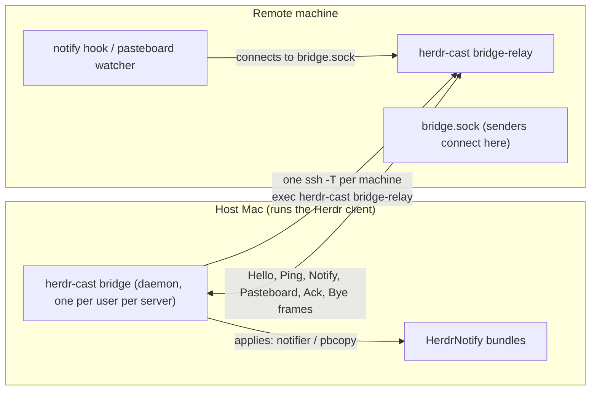

# The bridge

The bridge carries notifications and pasteboard copies from machines where
Herdr runs remotely (macOS or Linux) to the Mac running the Herdr client the
user looks at (the host). It uses its own protocol over plain ssh, not
Herdr's. A remote keeps its fallback behavior when the bridge is absent,
unreachable, or slow, so the bridge only ever adds a delivery path.



## Sender path

```text
notify::run (or forward::pasteboard watcher)
  → bridge::send_notification / send_pasteboard        src/bridge/mod.rs
    → socket connect to ~/.local/state/herdr-cast/bridge.sock
      - missing socket: silent fallback (normal on the host itself)
    → frame write: JSON header + body (16 KiB header / 1 MiB body caps)
    → wait for Ack: the relay gives up on the host's ack after ACK_TIMEOUT
      (4s); the sender waits SEND_TIMEOUT (5s) in total
  → on failure: log and fall back (notification.show, then local notifier;
    or OSC 52 for pasteboard)
```

## Host delivery path

```text
bridge::host reconcile loop (TICK 3s)                 src/bridge/host.rs
  → targets::scan: running `herdr --remote <target>` clients, grouped by
    `ssh -G` so aliases for one machine share a link
  → tunnel per machine: ssh -T -o BatchMode=yes -o ControlPath=none
      <target> 'exec herdr-cast bridge-relay'
  → Frame::Notify → notify::deliver_bridged            src/notify/bridged.rs
      - status bundle, PROJECT@HOST layout, group host:pane
      - click runs bridge-focus
  → Frame::Pasteboard → /usr/bin/pbcopy (PBCOPY_TIMEOUT 3s)
  → Ack sent only after the side effect was applied
```

## Click-to-focus path

```text
notification click → terminal-notifier -execute
  → herdr-cast bridge-focus <control.sock> <link-key> <session> <socket> <pane>
    → control socket (CONTROL_TIMEOUT 6s): ask the host daemon to send a
      Focus frame down the link named by the key
    → relay on the remote calls agent.focus on the notification's socket
      (FOCUS_TIMEOUT 2s)
    → host daemon collects candidate tab pids (Wanted::tab_pids: clients of
      the session first, newest first, each client pid then its parent's)
    → notify::raise_ghostty_tab raises the first matching Ghostty tab via
      AppleScript; no match: activate Ghostty only
```

The AppleScript runs only inside the click process, which executes within
the HerdrNotify bundle that holds the Automation grant. The bridge daemon
never drives Ghostty.

## Wire

Frames are one JSON header line plus an optional raw body of `len` bytes
(`src/bridge/wire.rs`):

| Frame | Header fields | Body |
| --- | --- | --- |
| `Hello` | `v`, `host`, `kinds` | — |
| `Ping` | — | — |
| `Bye` | `reason` | — |
| `Notify` | `id`, `host`, `pane`, `status`, `action`, `workspace`, `project`, `socket`, `session` | — |
| `Pasteboard` | `id`, `mime`, `len` | raw bytes (≤ 1 MiB) |
| `Ack` | `id`, `ok`, `error` | — |
| `Focus` | `id`, `socket`, `pane`, `session` | — |

Caps: 16 KiB header, 1 MiB body. Senders check the cap before connecting;
readers check before allocating.

## Link lifecycle

- Backoff per machine on failed links: 5 s doubling to 60 s.
- A remote whose `herdr-cast` lacks `bridge-relay` retries after 60 s
  (one ssh probe, then park).
- Both ends greet on connect: the relay sends its `Hello` first, the host
  answers with its own, and each side enforces `HELLO_TIMEOUT` (5 s); a
  version mismatch ends the link with a `Bye`.
- Pings every 15 s; a link with no ping for 45 s is dead to both ends.
- Takeover: two links to one machine (LAN + tailnet) — the relay binds the
  socket by rename, so the newer link wins; the loser parks until the set of
  linked machines changes, then resumes.
- The host closes a link when its last `herdr --remote` client for that
  machine exits. The daemon exits after sustained loss of its own Herdr
  socket.
- The relay removes the socket on exit only while the path still holds its
  own inode, and removes it before any other exit I/O.

## Timeouts

Ordered so a slow component reads as its own failure:

```text
notifier / pbcopy child (3s) < relay ack wait (4s) < sender wait (5s)
```

## Sockets and state

| Path | Owner | Purpose |
| --- | --- | --- |
| `~/.local/state/herdr-cast/bridge.sock` | relay (remote) | senders find the link; exists only while connected |
| `<state dir>/bridge.lock` | host daemon | one daemon per user |
| `<state dir>/bridge.log` | host daemon | size-capped stderr log |
| `<state dir>/bridge-control.sock` | host daemon | notification clicks ask for a Focus frame |

## Invariants

- Only the host daemon starts ssh, always with `BatchMode=yes` and
  `ControlPath=none`. Targets come from running `herdr --remote` processes;
  never store a machine list.
- Only `bridge-relay` creates or removes the remote bridge socket.
- The host acks only after applying. A failed apply acks with the error.
- Senders keep every pre-bridge path as the fallback. A missing socket is
  the normal case on the host itself and is not logged.
- The relay never panics on stdio errors; log with `let _ = writeln!(...)`.
- Run Ghostty AppleScript only from the click (`bridge-focus`, `focus`).

## Diagnostics

```bash
herdr-cast bridge-send [--socket PATH] notify --status done --action 'pi done'
herdr-cast bridge-send [--socket PATH] pasteboard < file
```

Prints `ok` or the reason the send failed. Linux builds keep the relay and
sender; the host daemon and pbcopy delivery are macOS-only.
